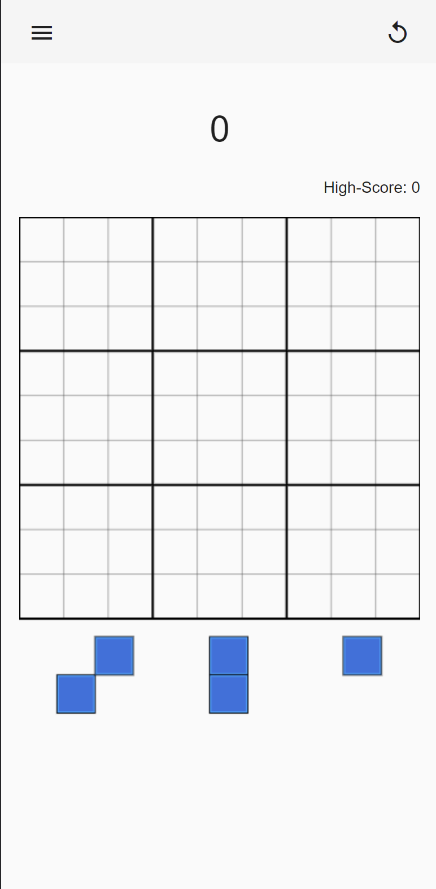

# BlockGame

This is the source code of the block game available under [block.rudx.live.](https://block.rudx.live/).

Screenshot of the game:  

## Development server

Run `ng serve` for a dev server. Navigate to `http://localhost:4200/`. The application will automatically reload if you change any of the source files.

## Build

Run `ng build` to build the project. The build artifacts will be stored in the `dist/` directory.
Or run `docker build -t block-game .` to build an docker container.
