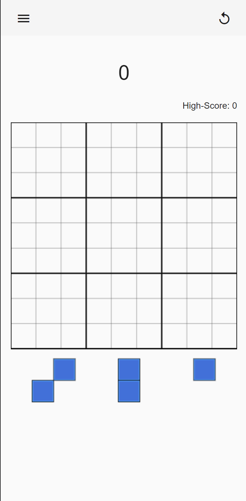

# BlockGame

This is the source code of the block game available under [block.rudx.live.](https://block.rudx.live/).

Screenshot of the game:  

## Development server

Use Node 24 and enable Corepack, then run `pnpm install`.

Run `pnpm start` for a dev server. Navigate to `http://localhost:4200/`. The application automatically reloads on source changes.

## Build

Run `pnpm build:prod`. Build output goes to `dist/`.
Or run `docker build -t block-game .`.
